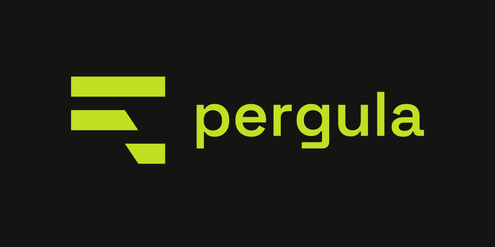

# brand/

Brand context for pergula, for humans and for design tools that read the
repository.

**Read in this order:**

| File | What it answers |
| --- | --- |
| [`concept.md`](concept.md) | **Start here.** pergula's twelve named ideas, each tied to a line of the source. |
| [`BRIEF.md`](BRIEF.md) | What pergula is, and what it is not. Distilled from the concept. |
| [`tokens.md`](tokens.md) | Palette, typography and radius, read off the real theme. |
| [`voice.md`](voice.md) | How the product already speaks, recorded so new writing matches it. |
| [`BRAND.md`](BRAND.md) | **The mark.** Specification v1 — geometry, measured colour, scale, lockup, limits. |
| [`BRAND-DIRECTION.md`](BRAND-DIRECTION.md) | **Every closed decision, and why.** Including the ones that cost two attempts. |
| [`color/`](color/) | 33 colour proofs. The lime confirmed by comparison, not inheritance. |
| [`marks/README.md`](marks/README.md) | Every round explored, and why each died or won. |
| [`archive-v1-2026-09-04/`](archive-v1-2026-09-04/) | The reasoning behind an abandoned v1 identity. The mark itself is gone; only the documents are worth keeping. |

**Source of truth for colour:** the `:root` block in `pergula`, around line 538.
[`tokens.md`](tokens.md) is a readable summary — if the two disagree, the CSS wins.

**Source of truth for the ideas:** [`concept.md`](concept.md). Where any other
file here contradicts it, the concept document wins.

## The method

This folder was rebuilt once, and the reason is worth keeping.

The first attempt ran a thirteen-section brand survey and went straight to
drawing. It produced twenty-six marks across four rounds, and every one was named
after a **construction technique** — `lapped-plates`, `modular-grid`,
`stepped-plates`, `rake-is-indent`. All were rejected.

The diagnosis was already written down, in `lifeshifter/brand/DIRECAO-MARCA.md`,
about a round that died two weeks earlier:

> *"Morreu porque um gesto abstrato não tem substantivo. Sem assunto, o olho e o
> modelo encaixam o traço no glifo familiar mais próximo."*

A survey produces **adjectives** — trustworthy, precise, minimalist. A mark needs
a **noun**. lifeshifter's twenty-two marks were each born from a named idea in its
framework — `desvio`, `teto`, `equalizador`, `alvo` — and its `marks/README.md`
says so explicitly: *"cada uma nasce de uma parte do framework."*

pergula had no framework document, so there were no nouns to draw from. Writing
[`concept.md`](concept.md) was the missing step, and it comes before everything
else in this folder.

## The mark



**A paragraph with a line snapped in two, the tail fallen below** — a picture of
*a quebra*, the newline the terminal puts inside a paragraph. The enemy the
product was built against, drawn. Full specification in [`BRAND.md`](BRAND.md).

| File | Use |
| --- | --- |
| `pergula-icon.svg` | The mark, 512 canvas |
| `pergula-lockup.svg` | Horizontal lockup, wordmark outlined to paths |
| `assets/favicon.svg` | Carries its own `prefers-color-scheme` query |
| `assets/favicon.ico` | 16/32/48, fixed `#6d8214` — legible on both browser chromes |
| `assets/apple-touch-icon.png` · `pwa-192` · `pwa-512` · `avatar-512` | Generated from `tile.svg` |
| `assets/readme-header.png` | 1024 × 512, above the prose in the root README |
| `assets/social-preview.png` | 1280 × 640, the GitHub card. Upload is web-only — Settings → General |
| `assets/pergula-knockout.svg` | The one official reversed form |

Everything in `assets/` is generated from `pergula-icon.svg`. Nothing is drawn by
hand, so the mark cannot drift between surfaces. The mark is also inlined into
`pergula` itself — as the tab favicon and as a 20px mark in the header — because
the page makes no network request of any kind.

## Rebuilding

Nothing here is a one-off. If `pergula-icon.svg` changes, everything downstream
regenerates:

```sh
python3 brand/build-lockup.py          # the lockup, wordmark outlined
python3 brand/color/proofs.py          # the 33 colour proofs, drawn with the real mark
python3 brand/marks/contact-sheet.py "nouns/*.svg"   # any set, both grounds
python3 ~/.claude/skills/battoni-new-brand/scripts/size-ladder.py brand/marks/nouns
```

The application assets in `assets/` are generated from `pergula-icon.svg` too —
regenerate rather than editing anything in there by hand, so the mark cannot
drift between surfaces.

The mark is inlined **twice** into `pergula` itself: as the tab favicon (a data
URI carrying its own `prefers-color-scheme` query) and as a 20px mark in the
header. The app also serves `/manifest.webmanifest` and `/icon.png`, so it
installs as a standalone window with its own dock icon. All three carry copies of
the mark that must be updated together.

`*.html` and `.ladder/` under `marks/` are build artefacts and are gitignored.

## Order of work

1. **`concept.md`** — the ideas, with names, evidenced from the source.
2. **`BRIEF.md`** — what it is and is not, distilled from those ideas.
3. **`tokens.md`** — the real theme, measured.
4. **`voice.md`** — how it already speaks.
5. **Marks** — one per idea, never per technique.
6. **Colour confirmed last**, by comparison rather than by inheritance. The lime
   is currently inherited from Battoni Dev and is explicitly *held, not settled*.
