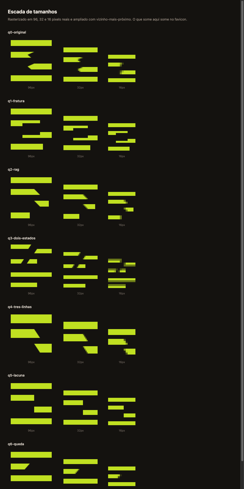

# Marks

Two attempts. The first produced 26 marks and none survived. The second follows
the vocabulary in [`../concept.md`](../concept.md), one mark per idea, in
[`nouns/`](nouns/).

## Why the first attempt failed

Every one of the 26 was named after a **construction technique**:
`lapped-plates` · `modular-grid` · `counter-led` · `stepped-plates` ·
`three-members` · `woven-assembly` · `rake-is-indent` · `offset-plates`.

Not one was named after an idea. They were formal exercises in how to build a
shape, and a shape without a subject gets filed by the eye under the nearest
familiar glyph. Round one produced twelve capital P's against a brand whose name
is always lowercase. Round three produced an **E**, a **reversed E** and two
**A's** — because a post with horizontal members attached is the anatomy of the
Latin alphabet.

The diagnosis existed in writing before this work started, in
`lifeshifter/brand/DIRECAO-MARCA.md`:

> *"Morreu porque um gesto abstrato não tem substantivo. Sem assunto, o olho e o
> modelo encaixam o traço no glifo familiar mais próximo — vírgula, 6, clave,
> raio."*

## Round 1 — twelve, all failed

`mark-01-lapped-plates` · `mark-02-beam-over-post` · `mark-03-counter-led` ·
`mark-04-knockout-plate` · `mark-05-three-members` · `mark-06-woven-assembly` ·
`mark-07-cantilever` · `mark-08-descender-post` · `mark-09-stepped-plates` ·
`mark-10-modular-grid` · `mark-11-shelter-over-line` · `mark-12-typographic-p`

Two structural failures. **Every legible mark read as an uppercase P**, because
the bowl took 60–70% of the height. And **the lapped joint proved invisible in one
flat colour** — two same-coloured members that overlap merge into one silhouette,
so the craft signature the brief specified could not exist. Marks that signalled
the lap by overshoot stopped being letters at all: `mark-11` read as **F**,
`mark-05` as **ㅠ**. Six of twelve also blurred at 16px, their coordinates not
landing on pixel boundaries.

Two lessons survived: **the step is visible where the lap is not**, and **a
32-unit module eliminates the blur** (512 ÷ 16 = 32, so one module is one pixel).

## Round 2 — six, technically correct

`r2-1-stepped-positive` · `r2-2-stepped-knockout` · `r2-3-offset-plates` ·
`r2-4-modular-minimum` · `r2-5-counter-dominant` · `r2-6-roof-overhang`

All six passed the lint, rasterised with zero anti-aliasing, and read
unmistakably lowercase. `r2-6` passed all eleven concept-test questions and was
built out to a complete identity — now in
[`../archive-v1-2026-09-04/`](../archive-v1-2026-09-04/).

**It was rejected anyway**, and correctly: it was a competent lowercase p that
said nothing about pergula. Technically flawless, no subject.

## Round 3 — eight structures

`r3-1-rake-is-indent` · `r3-2-indent-tree` · `r3-3-ancestor` · `r3-4-open-close` ·
`r3-5-counter-rake` · `r3-6-from-the-base` · `r3-7-minimal` · `r3-8-rafters`

Derived from `sketches/concept-5.svg`, an earlier sketch the founder liked:
a raked beam over posts, in three tones. Half collided with the alphabet — **r3-1
is an E, r3-4 a reversed E, r3-5 an A**. `r3-6` failed the lint outright.

One finding worth keeping: rebuilding concept-5 in a single flat colour cost it
its depth. In the designer's words, *"post, rail and beam now merge into one
silhouette instead of layering."* **Part of what made that sketch work was tonal
separation, not geometry.**

## Round 4 — abandoned mid-flight

Three of six drawn before the direction was stopped. One useful result: a rake
re-cut to the pixel grid rasterises far more cleanly than a free angle, because a
shallow slope gives long flat runs between pixel steps instead of continuous
fringing.

## The current attempt

[`nouns/`](nouns/) — one mark per idea in [`../concept.md`](../concept.md):
**break · reflow · quote · porch · session · noise · edge · live ·
permanence · boundary · nickname · tail.**

### Verdict on the twelve

**The marks about text worked. The marks about objects did not.**

Alive — `break` (text snapped mid-line, the tail fallen a row below) ·
`reflow` (one paragraph poured into two widths) · `quote` (a paragraph with
one line lifted out) · `edge` (messages taking turns, each with the bar on its
speaking edge). All four are about **text and how it behaves**, which is what
pergula is, and all four hold at 16px.

Dead, and all for the same reason — `boundary` is an acorn · `session` is a luggage
tag · `nickname` is a bottle with a card · `tail` is a comet · `live` is a candle
over two stubs · `permanence` is a stone in a stream (revised from an eye, which
is what twelve symmetric attempts produced first).

Each is a competent drawing of a thing and none says anything about a transcript
reader. This is the failure recorded in `lifeshifter/brand/DIRECAO-MARCA.md`,
rodada 6:

> *"Um objeto reconhecível desenhado por modelo raster vira ilustração de banco
> de imagem, não marca."*

It happened here without a raster model, which locates the cause more precisely:
**the trap is not the tool, it is asking for an abstraction.** *The boundary*,
*what stays*, *the live* cannot be drawn directly, so a designer reaches for an
object to stand in for them — and the object is what you end up owning. An acorn
is a lovely acorn.

The nouns that produced good marks were the ones already shaped like the thing
they name. *A quebra* is a break in text; you can draw it. *O limite* is a
conviction; you cannot.

`noise` failed differently: it was meant to be a page with pieces cut out and
reads as an abstract glyph, close to a letter.

Each had to pass a single test before anything else: finish the sentence *"It is
a picture of ___"* in plain words. If the only honest ending is "some shapes",
the mark fails regardless of how good the shapes are.

## The sketches that came first

[`sketches/`](sketches/) — five concepts drawn before any of this, when the brief
was three sentences. They are here because one of them mattered: `concept-5`, a
raked beam over posts, was the drawing that made the founder reject the finished
v1 identity and send the work back. Round three grew out of it.

## The tooling

| Script | What it does |
| --- | --- |
| `contact-sheet.py` | Every mark on `#14120f` and on white, in the colour that ships on each. Takes a glob pattern |
| `lint.py` | Round-one rules |
| `r2-lint.py` | The 32-unit module and lowercase proportion |
| `r3-lint.py` | Diagonal thickness measured perpendicular to the run, not from the bounding box |

The size ladder comes from the skill: `scripts/size-ladder.py`. It rasterises at
96, 32 and 16 actual pixels and magnifies with nearest-neighbour. `` is useless here — the browser resamples smoothly and hides the exact
defect you are looking for.

## The quebra round — six variants, and the choice

`break` was chosen from the twelve. Six variants, each attacking one named
weakness of it, in [`states/`](states/).

| Variant | Attacked | Result |
| --- | --- | --- |
| `q1-fracture` | The V reading as an arrow | The cut becomes a stair whose halves are 180°-congruent — one piece rotated, so they visibly fit back together. Its own designer flagged that the treads are 32u, under the 40u minimum, because 40u costs pixel alignment |
| `q2-rag` | Four equal bars reading as a menu | A real rag and a short last line. **Found that the original's down-left slant made the whole block read as a Z or a 2 at large sizes** — flipping the slant killed it. At 16px only the short last line survives; the subtle rag vanishes |
| `q3-two-states` | Nothing said the break was fixable | The same passage broken above and whole below. Reads as one thing twice at 24px+ — and at 16px it collapses to "messy paragraph, then clean paragraph". Too much for a square |
| **`q4-three-lines`** | The break starved of pixels | **Chosen.** Three lines instead of four buys 96-unit bars — 3 real pixels at 16px against everyone else's 2 — and spends it on a diagonal shear |
| `q5-gap` | The chevron entirely | The break as pure absence: the line stops, the tail restarts at exactly that x one row down. **The only mark in this project to rasterise at 16px with two alpha values and zero anti-aliasing.** Technically flawless, and the quietest — close to a generic text icon at a glance |
| `q6-fall` | The composition being too tidy to convey damage | The tail displaced 64 left and 288 down, breaking the bottom frame. Reads as error rather than pattern |

**`q4` won on presence.** At the size this mark actually lives at — a browser tab,
a 20px header slot — three pixels of line weight beat two, and the shear is
unmistakably a tear rather than an indent. `q5` is the better-engineered mark and
the weaker logo.

A pattern worth keeping across all four rounds: **this vocabulary keeps producing
accidental characters.** Round one gave capital P's, round three an E, a reversed
E and two A's, and q2 found a Z hiding in the original quebra's slant. Any new
variant should be checked against the alphabet before anything else.
